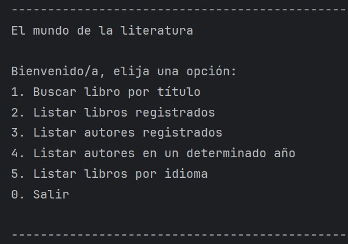

# Cátalogo de libros
Challenge Literatura - Programa ONE Oracle Next Education

## Descripción
En este desafio había que crear con Java un catálogo de libros utilizando la API de Gutendex.

Con un menú de diferentes opciones, donde cada selección tenga una funcion diferente.

Menú muy intuitivo y fácil de usar.

Dependiendo de la selección elegida se podra acceder a diferentes opciones y resultados.

## Herramientas utilizadas
- IDE: IntelliJ IDEA
- Versión de Java: 17.0.6
- Librería: Gson 2.10.1
- API: https://gutendex.com/
- Framework: Spring.io
  
## Autor
**Proyecto desarrollado por Victor Lara**
